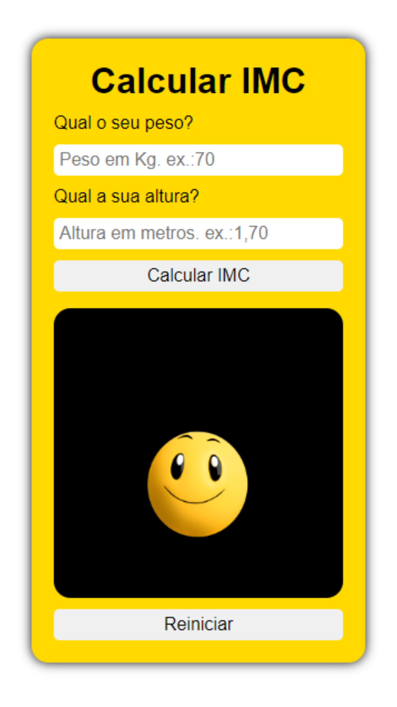

# Balança Fit

Uma forma descontraída de calcular o IMC (Índice de massa corporal) do usuário. A calculadora irá exibir uma pequena animação que irá variar de acordo com o resultado de cada IMC.

## Capturas de Tela

## Tecnologias
- HTML
- CSS
- JAVASCRIPT
- GIT

## Funcionalidades
- [x] Display interativo
- [x] Formulário para obter dados do usuário
- [x] Botões funcionais (gerar cálculo ou reiniciar)

## Demonstração
[Balança Fit]()

## Desenvolvedor
Bruno Coelho [Linkedin](www.linkedin.com/in/bruno-coelho-97b630220)

